# Unreal fbx导入问题总结

###1.UE4 导入FBX文件主要有两种方式：
- 内容浏览器中导入fbx
- 通过菜单的"文件->Actor->import into level from fbx 

两者的区别在于，前者只是将fbx导入到资源中，后者则导入场景中。

###2.内容浏览器中导入fbx
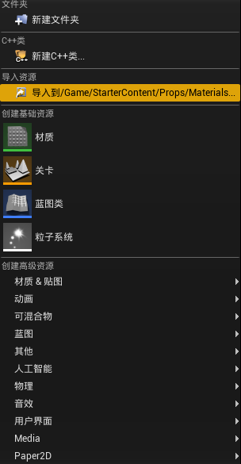   
倒入fbx后，可以看到以下菜单：    
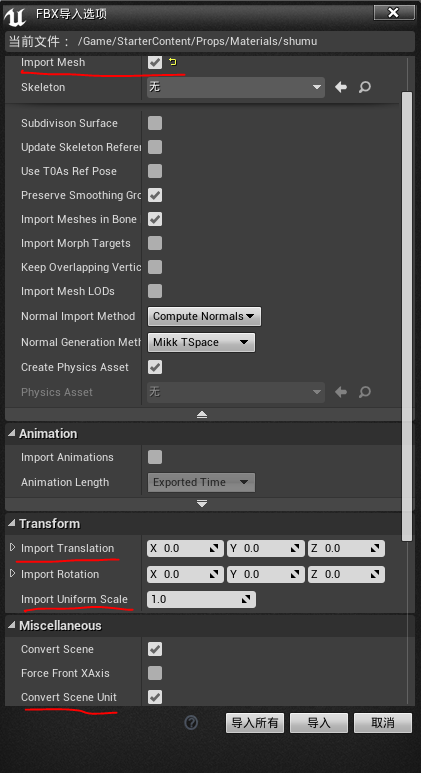  
**需要注意：**     

-  导入普通模型，需要把improt mesh勾选
-  坐标中心不在fbx中心，需要单独设置倒入的偏移分量(本人的做法是，打开3dmax，导入fbx，选择一个位于中心的模型，记下坐标，导入到UE4s时，输入负的偏移值，需要注意3dmax中的坐标单位，若为m，UE偏移需要乘以100倍)
-  fbx的单位若不确定，请勾选Convert scene unit，以便倒入正确的模型比例

###3.通过菜单的"文件->Actor->import into level from fbx 
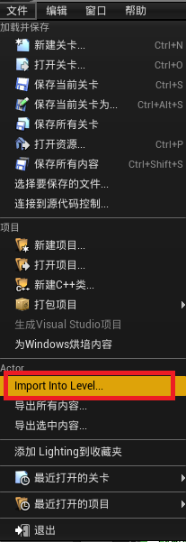  
选择fbx场景后，弹出以下界面，可以对scene属性页做相应设置：其中，Hierarchy Type 有三种设置选项:  

- Create one Blueprint asset （将模型组合为一个整体模型，当作蓝图导入）
- Create one Actor Width Components （将模型组合为一个整体模型，当作组建导入）
- Create level Actors (将模型导入到场景为多个分离的子模型)
 以上三点需要根据需要来设置。
      

###4.fbx导入后，树木融合错误      
  
将fbx在3dmax 打开，发现树木模型上的材质设置中，透明属性有如下设置：   
 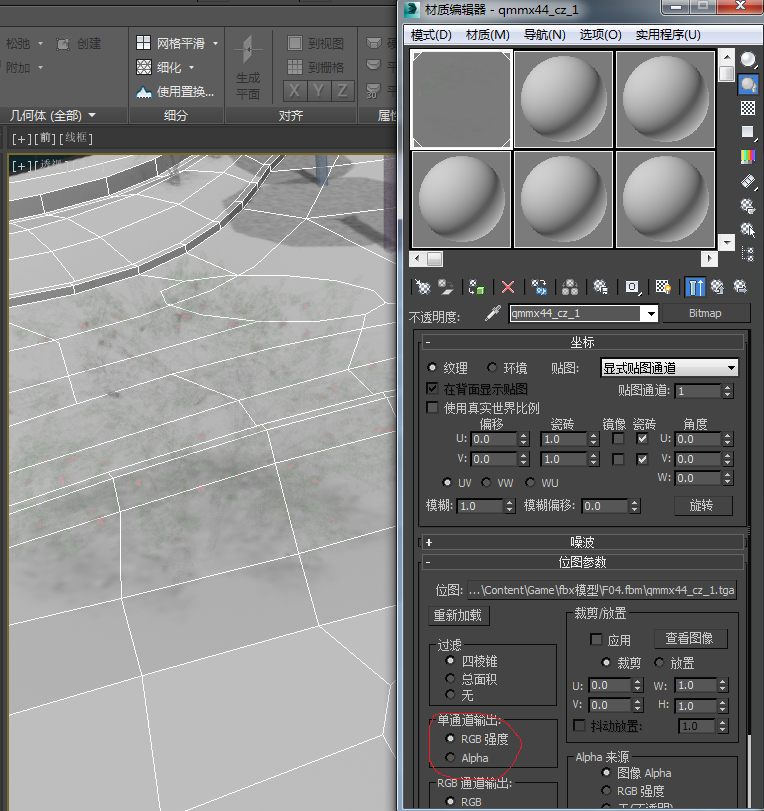   
将单通道输出的RGB强度改为Alpha,则在3dmax中树木的融合效果正常:   
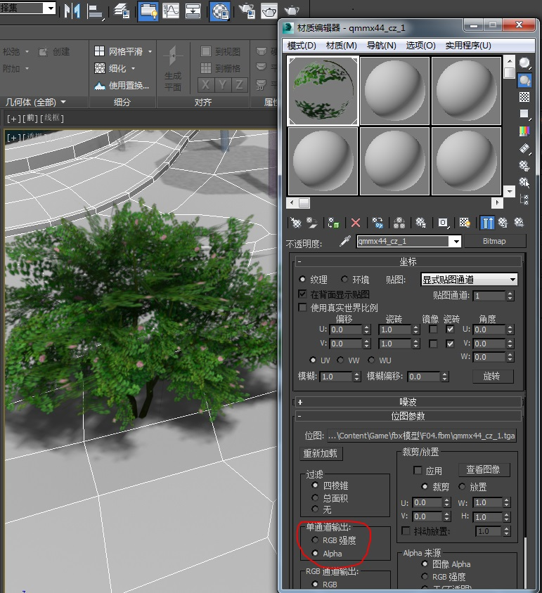

但导出fbx后，再导入UE4,树木融合依然存在问题：  
**原因：**    
   使用3dmax建模后，场景修设置了材质Mono Channel Output参数中的alpha属性；将max场景保存为fbx文件，但fbx中并不能存储Mono Channel OutPut 的参数设置，导致从fbx导入到UE4中，材质的alpha 混合出现错误。
导入到UE4中的错误材质：alpha通道识别错误
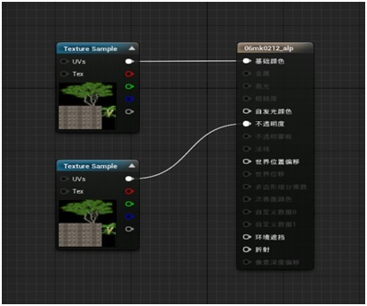    
在UE4中改成下图，材质就正确了：  
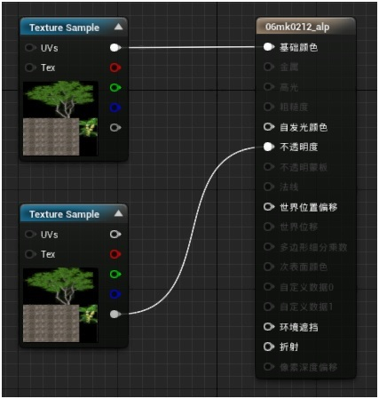   
**解决：** 

对于这个问题，可以通过其他方式来规避。UE4中，可以将材质纹理和alpha通道保存为两张图片，建议可以在制作Max场景时，单独使用一张图保存Alpha信息。如下图，导出alpha通道为单独tga文件。  
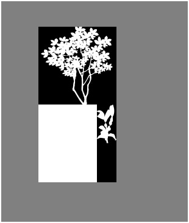  
正确的融合材质蓝图：    
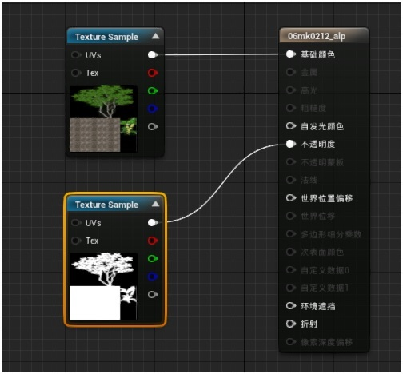  
3dmax 中材质设置如下图：  
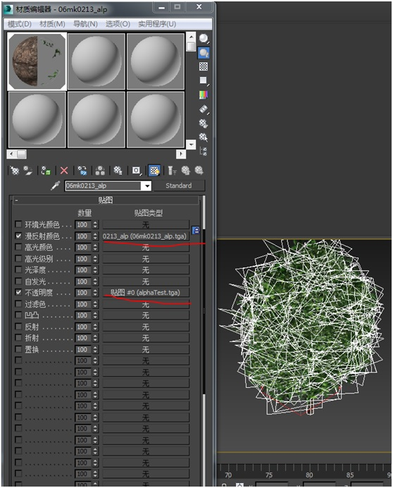  
**导入UE4中效果：**  
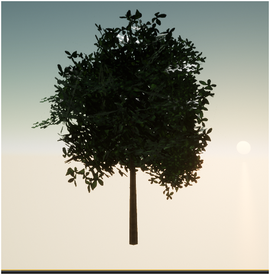  