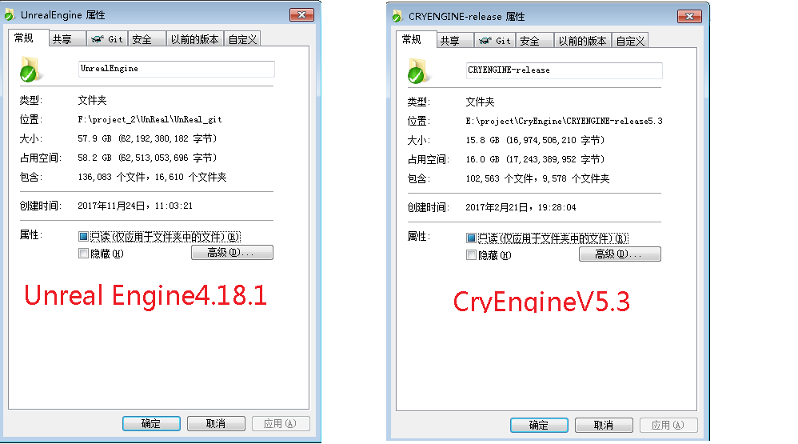

按照官网的指导，花了两天时间终于编译玩了大部分模块（有的模块也不是很重要，没便以通过也无所谓）。
比较让人震惊的是，源码和编译中间文件以及二进制文件总共近60GB,简直是个巨无霸，难怪CE会没落的，
和人家UE体量上就差了好多。
 

相比UE4的编译比较简单，成功编译后，就可以运行；CE5编译完还需要从对应发布版中拷贝资源，以及Editor.exe，
这个就是比较不太爽的地方，开源了大部分引擎代码，却没有放出编辑器代码，虽然官网说要公布，但迟迟没有结果。

当然，并不是说UE4工程大就是好事，但确实很吃机器，没有好的电脑，一天就只能眼看着机器超负荷运转，还卡顿的跑不动，
基本干不了什么活，UE4下16G的内存，场景一大，它都能爆满，导个fbx，一天时间才够，不说了，说多了都是眼泪。。。

