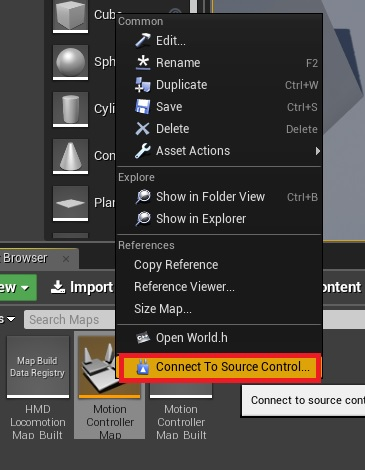
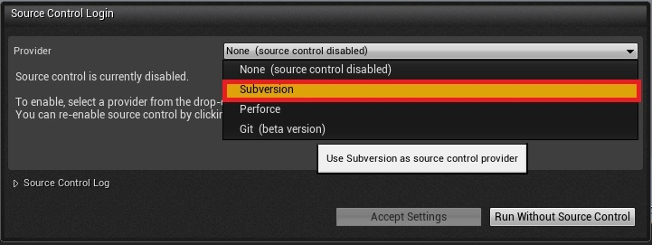
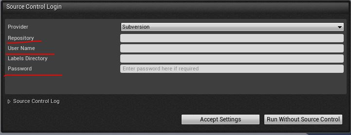

#UE4项目版本管理
UE4支持对场景资源的版本管理，主要常用的版本管理工具主要亦svn、git等，以下讲解如何使用svn进行UE4项目管理

1. 打开UE4项目，在资源浏览器中，选择任意文件右击，选择 Connect to source control,  

       
 出现如下对话框：  
    
 选择Subversion，出现svn用户信息录入(库路径、用户名、密码等)：
 
密码和用户名正确，即可成功连接登录。
2. 成功登录后，使用svn的方法：
 当有资源文件修改时，如，蓝图：

  
