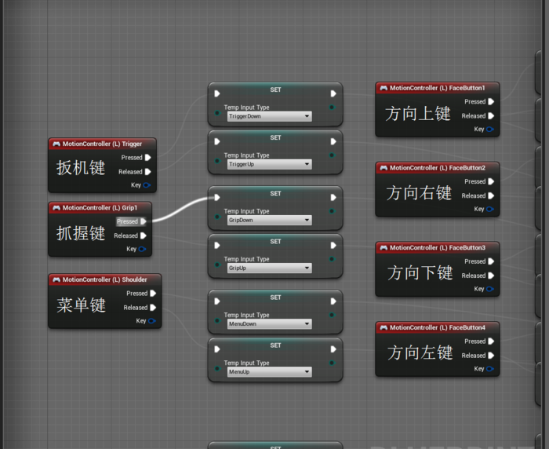
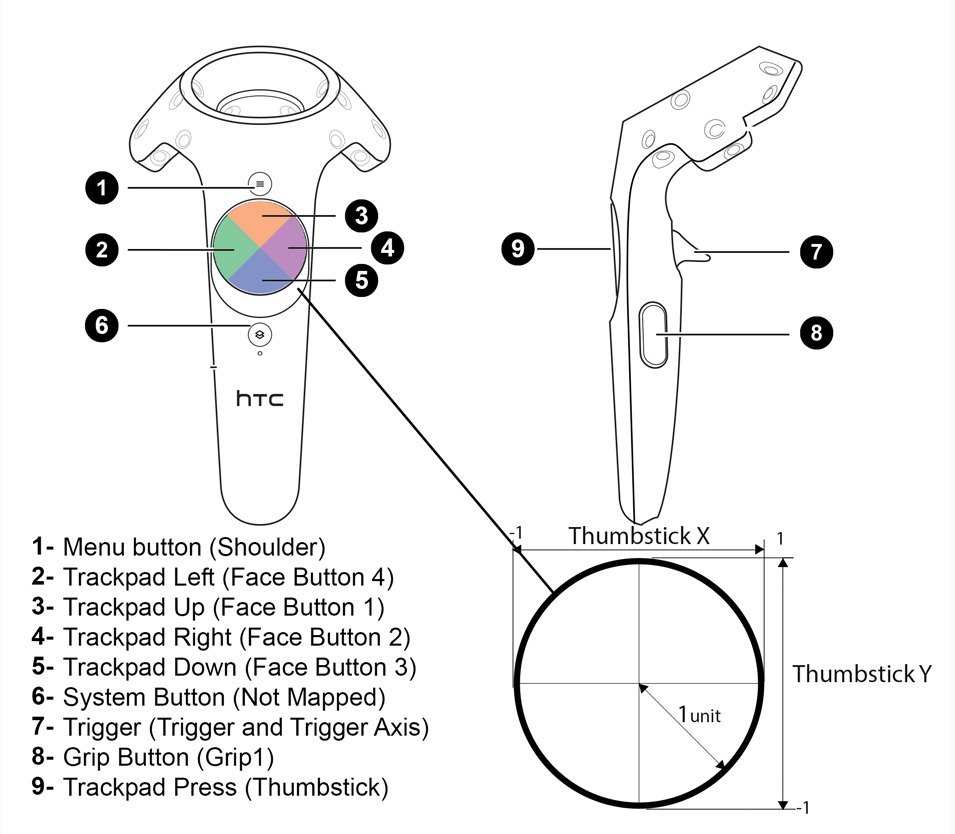

VR：

参考：
http://www.jianshu.com/p/2d839ff9a961  
https://forums.unrealengine.com/development-discussion/vr-ar-development/78620-steam-vr-template?106609-Steam-VR-Template=
https://docs.unrealengine.com/latest/INT/BlueprintAPI/Input/GamepadValues/index.html
## 手柄事件：

MotionController(L)Trigger： 扳机键
MotionController(L)TriggerAxis  扳机并获取强度值
MotionController(L)Grip1： 	握持键（一个手柄上有两个Grip按键，但只能触发Grip1事件）
MotionController(L)Shoulder：菜单键
MotionController(L)ThumbStick：pad键  
系统建：系统内部占用，外部不可用

 
 

# 官方给的注释： 

|	事件	 |描述																																								 |
|	---|---------------------------------------------------------------------------------------------------------------------------------------------------------------- |
|	MotionController (L) Grip1 Axis	| Returns the current value of input axis key MotionController (L) Grip1 Axis. If input is disabled for the actor the value will be 0.	|
|	MotionController (L) Grip2 Axis	| Returns the current value of input axis key MotionController (L) Grip2 Axis. If input is disabled for the actor the value will be 0.	|
|	MotionController (L) Thumbstick X	| Returns the current value of input axis key MotionController (L) Thumbstick X. If input is disabled for the actor the value will be 0.	|
|	MotionController (L) Thumbstick Y	| Returns the current value of input axis key MotionController (L) Thumbstick Y. If input is disabled for the actor the value will be 0.	|
|	MotionController (L) TriggerAxis	| Returns the current value of input axis key MotionController (L) TriggerAxis. If input is disabled for the actor the value will be 0.	|
|	MotionController (R) Grip1 Axis	| Returns the current value of input axis key MotionController (R) Grip1 Axis. If input is disabled for the actor the value will be 0.	|
|	MotionController (R) Grip2 Axis	| Returns the current value of input axis key MotionController (R) Grip2 Axis. If input is disabled for the actor the value will be 0.	|
|	MotionController (R) Thumbstick X	| Returns the current value of input axis key MotionController (R) Thumbstick X. If input is disabled for the actor the value will be 0.	|
|	MotionController (R) Thumbstick Y	| Returns the current value of input axis key MotionController (R) Thumbstick Y. If input is disabled for the actor the value will be 0.	|	
|	MotionController (R) TriggerAxis	| Returns the current value of input axis key MotionController (R) TriggerAxis. If input is disabled for the actor the value will be 0. 	|
[来源](https://docs.unrealengine.com/latest/INT/BlueprintAPI/Input/GamepadValues/index.html)

