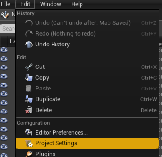
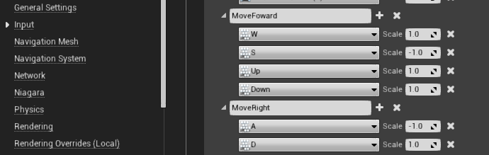
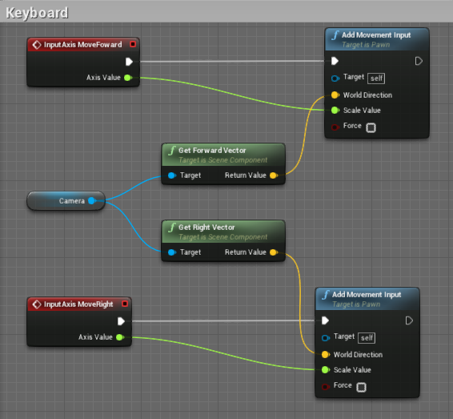
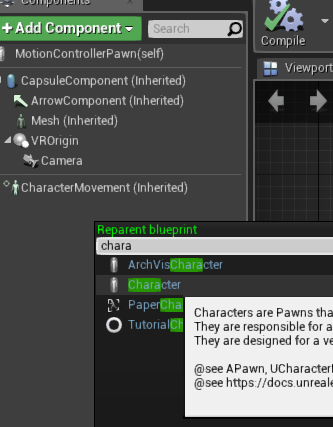
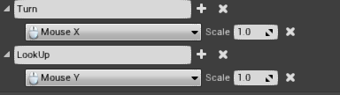
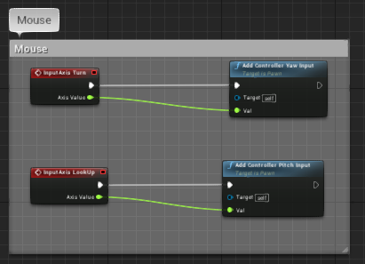
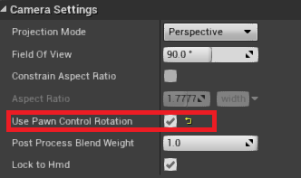

# VR项目添加键盘鼠标控制
 使用VR模版创建的项目，程序运行后，只能使用VR头盔进行交互场景，不便于调试工作，为此，在场景中添加键盘、鼠标控制功能。

## 1 .键盘控制添加：
**键盘控制主要为ASDW 键控制前后和移动,具体步骤如下：**  
 打开Editor->->Project Settings 对话框：   
    
找到Input选项，在Axis Mappings中添加MoveForward和MoveRight事件，如图：   
    
在要控制的对象蓝图中添加实现处理，如下图：  
   
此时，如果操控的对象为Pawn蓝图，则很不幸，键盘操作无效，如果椒character蓝图，则没有什么问题，
因为，蓝图中Add Movement Input 是作用在CharactorMoveMent组建的，pawn没有包含这一组建，
所以无法移动，补救措施为：在该蓝图的File菜单中，找到Reparent BluePrint,在输入框中输入：
Character，并选中：  
   
此时，左侧栏目中出现：CharacterMoveMent(inherited)组建,此时便可以正常使用键盘控制。

## 2. 鼠标控制：
同样在Project Settings中找到input选项，添加Turn和LookUp事件：  
  
切换到对象蓝图中，编写逻辑：  
   
这就完成了鼠标左右转头和俯仰的逻辑，但运行程序，发现只有左右转头可以运行，经过查找资料,
[https://answers.unrealengine.com/questions/116871/mouse-pitch-player-control-do-not-work.html](https://answers.unrealengine.com/questions/116871/mouse-pitch-player-control-do-not-work.html)   
      
说是摄像机属性需要设置mouse对相机旋转的控制,如图：  
   

## 3.至此，键盘和鼠标功能已经添加完成,但其他问题还没有完。

- VR模式下，只能移动鼠标进行左右转头，俯仰依然不行，普通模式两个功能都正常。
- 鼠标交互事件，VR模式下可以不使用，但非VR模式下，需要自定义PlayerController,
  来设置Mouse的一些属性，用于鼠标事件。

