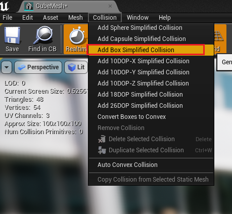

# VR项目中，创建可破碎物体

**Destructible 可破碎物体**

在UE4.17.1版本中，创建可破碎物体有多种方法，以下就将常用的几种进行总结。  
##1. 通过属性控制破碎

1.1 将场景中SphereMesh模型转换为颗破碎物体：在资源浏览器中选中SphereMesh模型，右键选择Create Destructible Mesh,
此时会自动创建SphereMesh_DM资源   
    
 在SphereMesh_DM 属性编辑器中，可以设置碰撞的给个属性，常用的有： 
 
- Damage Threshold--- 伤害阈值，当受到的伤害大于这个数值时，物体将会破碎。
- Damage Srpead--- 伤害扩散指数，指定伤害在物体上传递的速度。在应用范围伤害时产生作用，
距离伤害产生点为0的将受到所有的伤害，而到达Damage Radio的距离为止，伤害逐渐衰减为0。
- Enable Impact Damage --- 开启碰撞伤害，开启之后在与其他物体发生碰撞时将会接收伤害
- Impact  Damage --- 碰撞时接收伤害的指数,碰撞所受伤害为这个指数和冲击力的乘积
- Ceil Site Count --- 控制碎片数量   
- Accumulate Damage---累积伤害，当打开时物体会累积所受到的伤害。当累积伤害超过阈值时就会破碎。

    
1.2  将SphereMesh,SphereMesh_DM 拖拽到场景中，置于离地面一定高度，为了便于观察，给SphereMesh_DM添加红色材质，破碎截面为黄色材质，启动程序，两个模型处在空中没有反映。
1.3 修改场景中，模型的属性，启动物理模拟，模型可以自然坠落，但红色球仍然没有破碎，不要急，打开SphereMesh_DM，勾选Enable Impact Damage，再次启动程序，红色球在坠落地面后，破碎开来了：  
  

1.4 其他问题：
以同样的方式，用Cube模型创建颗破碎模型，拖入场景，结果Simulate Physics 不可用，这可很是尴尬，尝试修改static属性为movable，依然不懂，修改Collision Preset 也无效（好像根它没什么关系），后来想到物理、碰撞等，都与Collision辅助体相关，双击Cube模型，在菜单collison选择中，设置为：Add Box Simplified Collision:  
     
保存后，simulate Physics可用了，运行后，也可以正常坠落。但Sphere为何一开始就可以支持Simulate Physics ，而且勾选Simulate Physics ，自动变为Movable，却没想明白，以后在慢慢想吧。。。（还真是在后面想明白了，场景中的sphere是从base中创建的，浏览器中的Sphere是将场景中的Sphere保存为staticMesh的，所以Sphere支持Simulate Physics,导成模型再拖到场景中，就是没有物理属性了，需要创建Collision才行）
   
##2. 通过事件控制破碎
2.1 创建可破碎物体蓝图类：继续使用上面的Cube_DM ，在资源浏览器中，选中Cube_DM，右键，选择Assert Actions->Create BluePrint Using This...  保存蓝图为：BP_CubeMesh_DM。  
  

2.2 将生成的蓝图拖拽到场景中，将材质修改为绿色，添加Simulate Physics属性，启动程序后，依然可以破碎，此时，取消Enable Impact Damge属性，BP_Cube_DM 蓝图对象、Cube_DM都不能破碎。
 
2.3 打开BP_CubeMesh_DM蓝图，添加如下逻辑:  
      
并设置Destructible的，Collison选项 Simulation Generations Hit Events：  
    
2.3 运行程序，可以发现，红色Cube、绿色Cube落地后都没有破碎，但绿色Cube在相机移动过程中和它碰撞会触发破碎，原因也是以上逻辑引起：
相机靠近绿色Cube时，触发碰撞事件:先触发EventHit、再触发OnComponentHit,OnComponentHit事件执行ApplyRaduisDamage方法，产生破碎，并触发OnComponentFracture事件被触发。 
  
ApplyRaduisDamage 节点，可以直接触发物体破碎功能，同时，需要输入正确的参数，设置的BaseDamage为100才容易触发破碎，内部怎么计算破碎还没有搞明白。。。

##3.其他：
更多Destructible属性，请参考：[http://blog.csdn.net/kasteluo/article/details/78603371](http://blog.csdn.net/kasteluo/article/details/78603371)