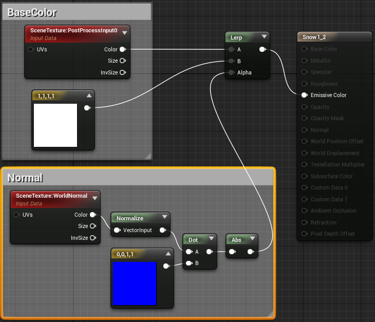
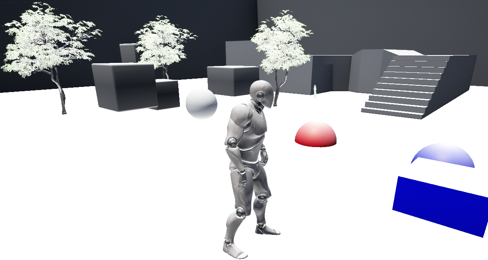

# Unreal Engine 树木积雪效果

#1.简介：  
在制作雪景效果时，主要以制作雪粒子系统为主，原来的场景却还是一片青翠，似乎有些太假。若是单独针对雪景创建场景，则工作量就会翻倍，有什么简便的办法，能够自动将当前场景附加上积雪效果呢，网上找了好久，UE4倒没有示例，不过找到一片Unity3d的教程：[http://forum.china.unity3d.com/thread-22366-1-1.html]()。大致的意思是，可以通过后处理，获取像素法线向上的点，附加白色，来模拟积雪效果，明白其原理，事情就好办了。

#2.创建材质
创建材质SnowPostEffect,设置其为postEffect  
  

#3.连接材质逻辑图：  

  

#4. 添加postEffectVolume 节点
  

#5.设置对postProcessVoume节点设置材质    
 

#6.最终效果图：

 
#7.其他
- 本示例只是简单的实现了积雪的效果，但总体效果还是有些假，如果有UE4的高级美工，还望多多赐教。
- 使用这种方式的场景，会出现轻微画面抖动（尤其是树叶），目前还没有找到原因，有高人请不吝指点。
- 物体虽然被遮挡，但因为法线向上，也被绘制成白色。

#8. 使用Deffered Decal 实现雪效果，解决场景抖动效果
- 创建一个decal 材质：DecalSnow,设置BaseColor为白色。
- 创建一个Decal bluePrint：DecalSnow_BP,将材质赋予DecalSnow_BP。
- 在场景中实例化DecalSnow_BP，并修改其大小，将整个场景包裹。

虽然以上方法解决了闪烁问题，但法线向上的遮挡物体仍然不能去除白色。

 [工程 source](https://github.com/longlongwaytogo/UE4_Learn/tree/master/BluePrint/PostSnowEffect)