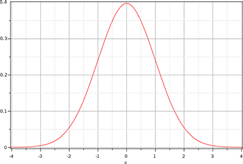

# HDR
High Dynamic Range  高动态范围图像
### 1. 什么是HDR：
HDR是指图像中保存了比普通图片更多的有关光照动态范围和图像细节的图片。HDR来源于摄影技术，摄影中，通过不同的曝光时间生成的多张图像，利用每个曝光时间对应的最佳细节的LDR（Low Dyanmic Range）图像，合成最终的HDR图像，这样可以更好的反应真实环境中的视觉效果。

## 2. 图形渲染中的HDR：
由于显示器被限制为只能显示值为0.0到1.0间的颜色，但是在光照方程中却没有这个限制。渲染中，通过使片段的颜色超过1.0，获得一个更大的颜色范围，即HDR渲染。有了HDR，亮的东西可以变得非常亮，暗的东西可以变得非常暗，而且充满细节。

HDR渲染的原理：
a. 使用更大范围的颜色值进行光照计算，从而从而获取大范围的黑暗与明亮的场景细节；
b. 将所有HDR值转换成在[0.0, 1.0]范围的LDR(Low Dynamic Range,低动态范围)。转换HDR值到LDR值得过程叫做色调映射(Tone Mapping)，这些色调映射算法经常会包含一个选择性倾向黑暗或者明亮区域的参数

## 3.一句话概括：
存储更多光照范围的明暗数据

## 4. 其他
4.1. 浮点帧缓冲： 
当帧缓冲使用了一个标准化的定点格式(像GL_RGB)为其颜色缓冲的内部格式，OpenGL会在将这些值存入帧缓冲前自动将其约束到0.0到1.0之间。这一操作对大部分帧缓冲格式都是成立的，除了专门用来存放被拓展范围值的浮点格式。

当一个帧缓冲的颜色缓冲的内部格式被设定成了GL_RGB16F, GL_RGBA16F, GL_RGB32F 或者GL_RGBA32F时，这些帧缓冲被叫做浮点帧缓冲(Floating Point Framebuffer)，浮点帧缓冲可以存储超过0.0到1.0范围的浮点值，所以非常适合HDR渲染。 
## 程序实现：
- 创建fbo，同时使用浮点缓存
- 将场景渲染到fbo
- 绘制一个四边形，对其进行色调映射，及gmma校正

# Tone Mapping : 色调映射
是一个损失很小的转换浮点颜色值至我们所需的LDR[0.0, 1.0]范围内的过程，通常会伴有特定的风格的色平衡(Stylistic Color Balance)。

# Gamma校正

# Bloom :	全屏泛光

是游戏中常用的一种镜头效果，是一种比较廉价的“伪HDR”效果；使用了Bloom效果后，画面的对比会得到增强，亮的地方曝光也会得到加强，画面也会呈现一种朦胧，梦幻的效果，婚纱摄影中照片处理经常用到这种类似处理效果。Bloom效果一般用来近似模拟HDR效果，效果也比较相向，但实现原理却完全不同.

###  HDR与bloom效果的差别到底在什么地方呢？
　　第一，HDR效果就是超亮的光照与超暗的黑暗的某种结合，这个效果是光照产生的，强度、颜色等方面是游戏程序可动态控制的，是一种即时动态光影；bloom效果则是物体本身发出的光照，仅仅是将光照范围调高到过饱和，是游戏程序无法动态控制的，是一种全屏泛光。
　
　第二，bloom效果无需HDR就可以实现，但是bloom效果是很受限的，它只支持8位RGBA，而HDR最高支持到32位RGBA。
　
　第三，bloom效果的实现很简单，比如《半条命2》的MOD就是一个很小的很简单的MOD，而且bloom效果不受显卡的规格的限制，你甚至可以在TNT显卡上实现bloom效果（当然效果很差）！而HDR，必须是6XXX以上的显卡才能够实现，这里的HDR是指nVIDIA的HDR。这时有必要谈nVIDIA和ATI的显卡所实现的HDR，两者还是有区别的，具体区别就很专业了，总之从真实性表现来看，nVIDIA的显卡实现的HDR更好一些。HDR是nVIDIA提出的概念，从技术上来讲，ATI当然无法严格克隆nVIDIA的技术，所以ATI的HDR是另一种途径实现的尽可能接近的HDR，不能算“真”HDR，据传ATI的R520能够真正实现FP16 HDR。
 
### Bloom特效的实现流程
  Bloom效果实现的流程与HDR的物理还原不同，它只是一种简单的近似模拟：
第一步： 先获取屏幕图像，然后对每个像素进行亮度检测，若大于某个阀值即保留原始颜色值，否则置为黑色；
第二步：对上一步获取的图像，做一个模糊，通常使用高斯模糊。
第三步：将模糊后的图片和原图片做一个加权和。
     通过这三步就可以达到一个全屏泛光的效果。

原文：https://blog.csdn.net/u011047171/article/details/48522073/ 

# Gaussian blur: 高斯模糊
高斯模糊基于高斯曲线，高斯曲线通常被描述为一个钟形曲线，中间的值达到最大化，随着距离的增加，两边的值不断减少。高斯曲线在数学上有不同的形式，但是通常是这样的形状：

# BPR (Base Physical Rendering: 基于物理的渲染)
[PBR Step by Step](https://www.cnblogs.com/jerrycg/p/4924761.html)
Reference：《PBRT》、《Ray Tracing from the Ground Up》

# BRDF
BRDF（Bidirectional Reflectance Distribution Function）双向反射分布函数，

# SSR (Scene Space Reflection:屏幕空间反射)
又叫实时局部反射(Realtime Local Reflection,RLR),最早见于2011年Crytek在Siggraph的Course《Secrets of CryENGINE 3 Graphics Technology》。传统的反射是以平面或Cubecmap来处理反射信息,Cubemap更多的是处理静态反射环境。SSR做为补充，实现了以较低的开销在不规则表面的动态反射问题。

# Screen Space Reflection (SSSR)
[高级屏幕空间反射](https://www.cnblogs.com/neoragex2002/p/6216396.html)

# 菲涅尔方程
菲涅尔（发音为Freh-nel）方程描述的是被反射的光线对比光线被折射的部分所占的比率，这个比率会随着我们观察的角度不同而不同。当光线碰撞到一个表面的时候，菲涅尔方程会根据观察角度告诉我们被反射的光线所占的百分比。利用这个反射比率和能量守恒原则，我们可以直接得出光线被折射的部分以及光线剩余的能量。
FSchlick(n,v,F0)=F0+(1−F0)(1−(n⋅v))5

# 线性渲染（Linear Rendering）和Gamma Correction
线性渲染就是渲染场景所有输入都是线性的。一般来说存在的纹理都是经过Gamma矫正了的，也就是说当纹理被采样到一个材质上时，颜色值已经不是线性的了。如果这些纹理用通常的计算方式去计算光照和图片效果，在非线性空间计算，这将导致轻微的偏差。（而这种偏差就是需要Gamma矫正的原因）

线性渲染保证了在shader中输入与输出都是在正确的颜色空间得出更正确的结果。

## Gamma Correction
所谓伽玛校正就是对图像的伽玛曲线进行编辑，以对图像进行非线性色调编辑的方法，检出图像信号中的深色部分和浅色部分，并使两者比例增大，从而提高图像对比度效果。计算机绘图领域惯以此屏幕输出电压与对应亮度的转换关系曲线，称为伽玛曲线（Gamma Curve）。以传统CRT（Cathode Ray Tube）屏幕的特性而言，它的输入电压和显示出来的亮度关系不是线性的，而是一个类似幂律（pow-law）曲线的关系，而这个关系又恰好跟人眼对光的敏感度是相反的。这个巧合意味着，虽然CRT显示关系是非线性的，但对人类来说感知上很可能是一致的。

Gamma 校正补偿了不同输出设备存在的颜色显示差异，从而使图像在不同的监视器上呈现出相同的效果。

保存颜色信息本身矫正称为encoding gamma，显示器对颜色的矫正称为display gamma，所以一个完整的图形系统中需要两个Gamma值，两次矫正刚好在一定程度上抵消（但一般不是完全抵消）。

原文：https://blog.csdn.net/k46023/article/details/52489363 

## sRGB

个人电脑使用的一个标准叫sRGB，它使用的encoding gamma大约是0.45（1/2.2），这个值为了配合display gamma为2.5的设备工作的，这样两次gamma矫正后产生偏差为0.45 * 2.5 = 1.125，从而在视觉上进行了补偿。

## 非线性输入

大部分图像文件都进行了提前矫正，就是保存文件时已经使用了encoding gamma对像素值编码，这意味着它是非线性的，如果在shader中直接使用就是在非线性空间计算，使得结果和真实世界结果不一致。
[我理解的伽马校正（Gamma Correction）](https://blog.csdn.net/candycat1992/article/details/46228771)

# IBL Image Base Lighting 基于图像的光照

## 矩形球面投影 equirectangular
